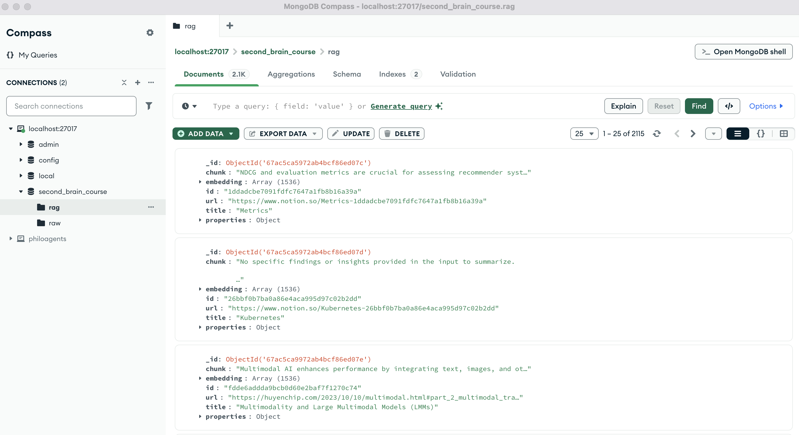

<table style="border-collapse: collapse; border: none;">
  <tr style="border: none;">
    <td width="20%" style="border: none;">
      <a href="https://decodingml.substack.com/" aria-label="Decoding ML">
        
      </a>
    </td>
    <td width="80%" style="border: none;">
      <div>
        <h2>📬 Stay Updated</h2>
        <p><b><a href="https://decodingml.substack.com/">Join Decoding ML</a></b> for proven content on production-grade AI, GenAI, and information retrieval systems. Every week, straight to your inbox.</p>
      </div>
    </td>
  </tr>
</table>

<p align="center">
  <a href="https://decodingml.substack.com/">
    
  </a>
</p>

------

# Workshop on Building Advanced RAG Applications and Systems


# 📑 Table of Contents

- [📋 Prerequisites](#-prerequisites)
- [🎯 Getting Started](#-getting-started)
- [🏗️ Set Up Your Local Infrastructure](#-set-up-your-local-infrastructure)
- [⚡️ Running the Code](#️-running-the-code-for-each-module)

# 📋 Prerequisites

## Local Tools

For all the modules, you'll need the following tools installed locally:

| Tool | Version | Purpose | Installation Link |
|------|---------|---------|------------------|
| Python | 3.12 | Programming language runtime | [Download](https://www.python.org/downloads/) |
| uv | ≥ 0.4.30 | Python package installer and virtual environment manager | [Download](https://github.com/astral-sh/uv) |
| GNU Make | ≥ 3.81 | Build automation tool | [Download](https://www.gnu.org/software/make/) |
| Git | ≥2.44.0 | Version control | [Download](https://git-scm.com/downloads) |
| Docker | ≥27.4.0 | Containerization platform | [Download](https://www.docker.com/get-started/) |

## Cloud Services

Also, the course requires access to these cloud services. The authentication to these services is done by adding the corresponding environment variables to the `.env` file:

| Service | Purpose | Cost | Environment Variable | Setup Guide |
|---------|---------|------|---------------------|-------------|
| [OpenAI API](https://openai.com/index/openai-api/) | LLM API | Pay-per-use | `OPENAI_API_KEY` | [Quick Start Guide](https://platform.openai.com/docs/quickstart) |

When working locally, the infrastructure is set up using Docker. Thus, you can use the default values found in the [config.py](src/second_brain_offline/config.py) file for all the infrastructure-related environment variables.

But, in case you want to deploy the code, you'll need to setup the following services with their corresponding environment variables:

| Service | Purpose | Cost | Required Credentials | Setup Guide |
|---------|---------|------|---------------------|-------------| 
| [MongoDB](https://rebrand.ly/second-brain-course-mongodb) | document database (with vector search) | Free tier | `MONGODB_URI` | 1. [Create a free MongoDB Atlas account](https://rebrand.ly/second-brain-course-mongodb-setup-1) <br> 2. [Create a Cluster](https://rebrand.ly/second-brain-course-mongodb-setup-2) </br> 3. [Add a Database User](https://rebrand.ly/second-brain-course-mongodb-setup-3) </br> 4. [Configure a Network Connection](https://rebrand.ly/second-brain-course-mongodb-setup-4) |

# 🎯 Getting Started

## 1. Clone the Repository

Start by cloning the repository and navigating to the workshop directory:
```
git clone https://github.com/decodingml/second-brain-ai-assistant-course.git
cd second-brain-ai-assistant-course/workshops/rag
cd solution # or template
```

## 2. Installation

To install the dependencies and activate the virtual environment, run the following commands:

```bash
uv venv .venv-rag
. ./.venv-rag/bin/activate # or source ./.venv-rag/bin/activate
uv pip install -e .
```

## 3. Environment Configuration

Before running any command, you have to set up your environment:
1. Create your environment file:
   ```bash
   cp .env.example .env
   ```
2. Open `.env` and configure the required credentials following the inline comments and the recommendations from the [Cloud Services](#-prerequisites) section.

# 🏗️ Set Up Your Local Infrastructure

We use Docker to set up the local infrastructure (ZenML, MongoDB).

> [!WARNING]
> Before running the command below, ensure you do not have any processes running on port `27017` (MongoDB).

To start the Docker infrastructure, run:
```bash
make local-infrastructure-up
```

To stop the Docker infrastructure, run:
```bash
make local-infrastructure-down
```

> [!NOTE]
> To visualize the raw and RAG data from MongoDB, we recommend using [MongoDB Compass](https://rebrand.ly/second-brain-course-mongodb-compass) or Mongo's official IDE plugin (e.g., `MongoDB for VS Code`). To connect to the working MongoDB instance, use the `MONGODB_URI` value from the `.env` file or found inside the [config.py](src/second_brain_offline/config.py) file.



# ⚡️ Running the Code

The ML pipeline consists of three main steps that can be run using Make commands:

1. **Data Ingestion Pipeline**
   ```bash
   make run-ingestion-pipeline
   ```
   This step processes and loads your raw data into the vector database.

2. **Generation Pipeline**
   ```bash
   make run-generation-pipeline
   ```
   This step runs the RAG pipeline to generate responses.

3. **Interactive Agent Application**
   ```bash
   make run-agent-app
   ```
   This launches an interactive application where you can interact with the agentic RAG system.

> [!IMPORTANT]
> Make sure you have the local infrastructure running (`make local-infrastructure-up`) before executing any of these pipeline steps.

